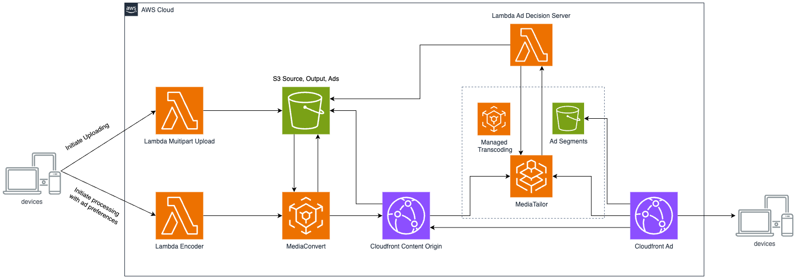

# Simple Elemental Video
Deploy a server side ad insertion(SSAI) aws video pipeline



# Cloudformation Docs
[MediaConvert](https://docs.aws.amazon.com/AWSCloudFormation/latest/UserGuide/AWS_MediaConvert.html)

[MediaTailor](https://docs.aws.amazon.com/AWSCloudFormation/latest/UserGuide/AWS_MediaTailor.html)

# Prerequisites
- [Docker](https://www.docker.com/get-started)
- [Aws Cli](https://aws.amazon.com/cli)
- Make

# Login to Your Aws Account
You can set the environment variables manually or

```sh
eval "$(aws configure export-credentials --profile your-profile-name --format env)"
```

Export a region
```sh
export AWS_REGION=eu-north-1
```

# Run Everything at Once
> For security, we whitelist your public ip on mediaconnect, which means if you have a carrier NAT, you might not be able to push video, in that case, change [this](./main.tf#20) to `0.0.0.0/0`

Run the following command from the terminal
```sh
make tf-deploy
```
This should print a mediatailor domain along with other things

# Destroy Everything
Run the following command from the terminal
```sh
make tf-destroy
```